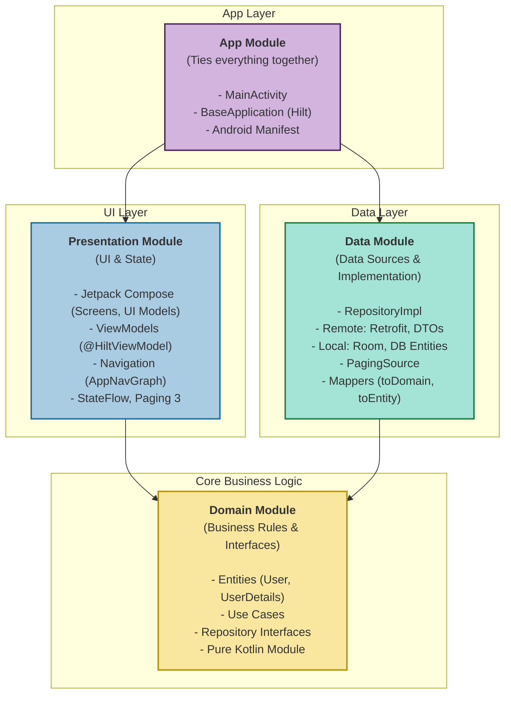

# GitHub Users App

## Overview

This Android project is built entirely with Kotlin and Gradle, featuring a modern architecture with
Jetpack Compose for UI, Paging 3 for efficient data loading, Clean Architecture principles, Hilt for
dependency injection, and KSP (Kotlin Symbol Processing) for annotation processing.

## Architecture

This project follows the principles of **Clean Architecture**, separating concerns into distinct layers. This makes the codebase modular, scalable, testable, and maintainable.



## Project Structure

The project is organized into the following modules:

```
.
├── app/                # Main application module (entry point)
├── data/               # Data sources, repositories, API, local storage
│   ├── api/
│   ├── di/
│   ├── localstorage/
│   └── repoimpl/
├── domain/             # Business logic, entities, use cases, repository interfaces
│   ├── di/
│   ├── entities/
│   ├── repositories/
│   └── usecases/
├── presentation/       # UI layer (Screens, ViewModels, UI models, Navigation)
│   ├── ui/
│   │   ├── components/
│   │   ├── navigation/
│   │   └── userdetails/
│   │   └── userslist/
└── build.gradle.kts    # Root build file
```

## Features

- Search GitHub users locally
- Paginated list with efficient loading using `PagingData`
- User details with fallback to local cache
- Network status tracking with automatic retry on reconnection
- Clean Architecture (Domain, Data, App layers)
- Dependency Injection with Hilt
- Modular, testable, and scalable codebase

## Requirements

- Android Studio (latest stable)
- JDK 11 or newer
- Gradle 7.x or newer

## Setup

1. Clone the repository:
   ```bash
   git clone https://github.com/yourname/github-users-app.git

2. Open the project in Android Studio

3. Ensure the Gradle JDK is set to JDK 11 or newer:
    - `Preferences` > `Build, Execution, Deployment` > `Build Tools` > `Gradle` > `Gradle JDK`
4. Sync the project and build.

## Troubleshooting

- If you encounter issues with annotation processing, ensure you are using KSP and not KAPT in your
  `build.gradle` files.
- Make sure your JDK version matches the project requirements.

⚠️ Dark Mode Notice:
Only light mode design was provided and implemented. Dark mode support is not fully styled or verified.